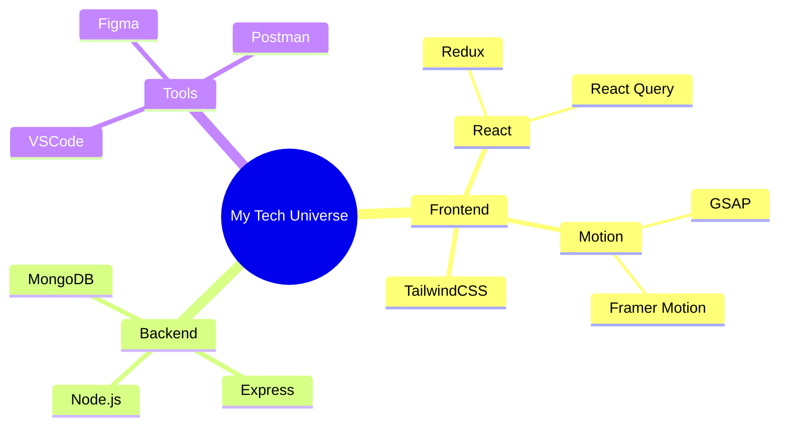

  

## ⚡ Core Technologies

  <table style="background: transparent;">
    <tr>
      <td align="center" width="96">
        

          
           React
        

      </td>
      <td align="center" width="96">
        

          
           JavaScript
        

      </td>
      <td align="center" width="96">
        

          
           Express.js
        

      </td>
    </tr>
  </table>

## 🎯 Specialized Skills

  

    <h3>Frontend Magic ✨</h3>
    

       
      
      
    

  

  

    <h3>Backend Power 🚀</h3>
    

      
    

  

## 📊 Performance Metrics

  
  
  

## 🌐 Digital Presence

  
  
  

  

  

